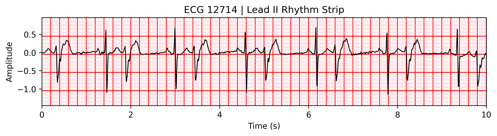

# Interpretable ECG Diagnosis with Deep Learning

## Introduction



This repository contains everything related to the final project conducted as part of the course *AI in Healthcare* of the *MERIT MSc in Machine Learning and Cybersecurity for Internet Connected Systems* by EPSEM-UPC.

Both the [original proposal](proposal.pdf) and the [final report](report.pdf) are included in the repository, take a look at them to read about the goals of the project and the results obtained by the end of it.

This project consists in replicating a simplified version of [ProtoECGNet](https://arxiv.org/abs/2504.08713) (GitHub repository available [here](https://github.com/bbj-lab/protoecgnet/tree/main)), consisting only of the rhythm-based branch for diagnosis of cardiovascular diseases. To achieve this, we slightly adapted the code available in the original repository according to their documentation to only train and evaluate the rhythm-based branch. The training process along with the evolution of macro AUCROC (our main metric of interest) and the learned prototypes are logged to and can be accessed from TensorBoard.

The following descriptions describe the setup for the project, with detailed instructions for reproducing the results, along with a brief overview of the results.

> **NOTE:** this repository also contains the adapted original code for [ProtoECGNet](https://arxiv.org/abs/2504.08713) for ease of use in our particular setup (i.e. only the rhythm-based branch, with the default hyperparameters and fine-tuning). Again, all credit for that goes to the original authors of the project, this is just a slightly modified version of their code (essentially just changes in default configurations), available [here](https://github.com/bbj-lab/protoecgnet/tree/main). For convenience, the original code was uploaded first in one commit, and then the changes made to adapt it to our project were uploaded in a second commit, so you can easily see the differences between the original code and our adapted version.

# Set up

## Prerequisites

To run the code in this repository, you will need to have Anaconda (or a variant such as Miniconda) installed for Python version `3.10`.

You also need to download version 1.0.3 of the PTB-XL dataset, which can be found [here](https://physionet.org/content/ptb-xl/1.0.3/). We recommend downloading the compressed version of the dataset, which you will then need to extract to `ai-in-healthcare-project/ptb-xl/1.0.3`:

```
ai-in-healthcare-project$>$ tree
...
.
├───protoecgnet
├───ptb-xl
│   └───1.0.3
├───...
└───experiments
    ├───preprocessing
    ├───checkpoints
    ├───test_results
    └───logs
```

> **NOTE:** Make sure to create the directory structure as shown above, since the code expects certain directories to be in place for it to work correctly. The directories under `experiments` should be created by the code automatically when running the training process, but the containing folder and the `ptb-xl/1.0.3` directory need to be there.

After that, make sure to copy the CSV file `scp_statementsRegrouped2.csv`, to the `ptb-xl/1.0.3` directory. This file is used to group the labels in the dataset according to the original paper's label groupings (of which we will only use label `"1"`, for 1D rhythm).

Finally, we recommend performing a repository-wise replacement (using your favourite tool) of the string `"/home/paudelasheras/ai-in-healthcare-project/"` with the path to your local copy of the repository (e.g. `"/path/to/your/local/repo/ai-in-healthcare-project/"`), so that all paths are correctly set up.

### Training and testing the model

> **NOTE:** All commands in this section should be run from the root directory of the repository, i.e. `ai-in-healthcare-project/`.

Before following any of the steps below, first make sure to activate the `conda` environment for ProtoECGNet. To do so, run the following commands:

```bash
cd protoecgnet
conda env create -f environment.yml --name ecg_env
conda activate ecg_env
```

Then, activate TensorBoard logging to be able to visualize the training process and results by running the following command:

```bash
tensorboard --logdir=/experiments/logs --port 6006
```

As training progresses, TensorBoard allows one to visualize various metrics and generated assets through an intuitive graphical interface:


If working on a remote server (e.g. a HPC), set up port forwarding via SSH  with:

```bash
ssh -L 6006:localhost:6006 myaccount@example_computer.edu
```

Finally, access http://localhost:6006 in your browser to follow the training process and results.

> **NOTE:** Adjust port numbers as needed in the previous commands.

#### Preprocessing

The first step is to preprocess the PTB-XL dataset. The only step needed is to run the script that pre-computes the label co-occurrence matrices, [`label_co.py`](./protoecgnet/src/label_co.py), which will create the `label_cooccur_Cat1.pt` file in the `experiments/preprocessing` directory.

```bash
cd protoecgnet/src
python label_co.py
```

#### Training stages

The training process is split multiple steps, some of which can be run separately or jointly, giving way to two different approaches for training the model. The first approach consists in training the feature extractor and the prototype learning separately, while the second approach consists in training them jointly. The final stages are always the same, which are prototype projection and classifier training.

For our project we tested both approaches, and reported the results of both. Both approaches are described below, along with the commands to run each stage of the training process.

> **NOTE:** We use the default hyperparameters as described in the original paper, partly for reproducibility and partly due to issues regarding the setup necessary for the hyperparameter tuning process (see below).

##### Separate feature extractor and prototype learning training

> **NOTE:** the few following commands corresponding to executoins of the train script with slightly different arguments for each training stage. For brevity, we only include the full command in the first instance, so keep all command line arguments not explicitly mentioned in subsequent commands the same.

The command for the first stage (training the feature extractor) is as follows (make sure to change the paths to your local copy of the repository):

```bash
cd protoecgnet/src
python3 main.py \
    --job_name "1D_rhythm_train_feature_extractor" \
    --training_stage "feature_extractor" \
    --epochs 200 \
    --batch_size 32 \
    --lr 0.0001 \
    --checkpoint_dir "/home/paudelasheras/ai-in-healthcare-project/experiments/checkpoints" \
    --log_dir "/home/paudelasheras/ai-in-healthcare-project/experiments/logs" \
    --save_top_k 3 \
    --patience 10 \
    --resume_checkpoint False \
    --dimension "1D" \
    --backbone "resnet1d18" \
    --single_class_prototype_per_class 18 \
    --joint_prototypes_per_border 0 \
    --sampling_rate 100 \
    --label_set "1" \
    --save_weights True \
    --seed 42 \
    --num_workers 4 \
    --dropout 0.35 \
    --l2 0.00017 \
    --scheduler_type "CosineAnnealingLR" \
    --custom_groups True \
    --proto_time_len 32 \
    --proto_dim 512
```

For the second stage, learning the prototypes, run the following commands (do not change the previous arguments, except for the ones explicitly mentioned):

```bash
python3 main.py \
    --job_name "1D_rhythm_train_prototypes" \
    --training_stage "prototypes" \
    --pretrained_weights "/home/paudelasheras/ai-in-healthcare-project/experiments/checkpoints/1D_rhythm_train_feature_extractor/last.ckpt" \
    ...
```

##### Joint feature extractor and prototype learning training

In the joint training approach, the feature extractor and prototype learning are trained together, which can be done by running the following command:

```bash
python3 main.py \
    --job_name "1D_rhythm_train_joint" \
    --training_stage "joint" \
    ...
```

##### Prototype projection and classifier training

In both cases, the next stage consists of projecting the prototypes, which can be done by running the following commands (do not change the previous arguments, except for the ones explicitly mentioned):

```bash
python3 main.py \
    --job_name "1D_rhythm_train_projection" \
    --training_stage "projection" \
    --pretrained_weights "/home/paudelasheras/ai-in-healthcare-project/experiments/checkpoints/1D_rhythm_train_prototypes/last.ckpt" \
    ...
```

This generates the actual prototypes that will be used for the classification task, which can be visually inspected in the `/home/paudelasheras/ai-in-healthcare-project/experiments/checkpoints/1D_rhythm_train_projection/prototype_ecgs_1D_rhythm_train_projection` directory. To illustrate the type of prototypes learned, we show the complete ECG from which the prototype at the top of this README was extracted, which corresponds to a train sample labeled as suffering bigeminal pattern (BIGU) and sinus rhythm (SR), both classes in the 1D rhythm branch of ProtoECGNet. Note that in this case the prototype is learnt as a representative of the BIGU class only, since the prototype learning stage is trained to learn a single prototype per class, which is then used for classification (i.e. "this test case probably suffers BIGU since it is similar to a prototype related to a test case that suffered BIGU as well").


For the final stage, training the classifier, run the following commands (do not change the previous arguments, except for the ones explicitly mentioned, and change the path to the pretrained weights to `".../1D_rhythm_train_joint/last.ckpt"` for the joint training approach):

```bash
python3 main.py \
    --job_name "1D_rhythm_train_classifier" \
    --training_stage "classifier" \
    --pretrained_weights "/home/paudelasheras/ai-in-healthcare-project/experiments/checkpoints/1D_rhythm_train_prototypes/last.ckpt" \
    ...
```

> **NOTE:** Unfortunately, given the limited scope of our project we could not perform fine-tuning of the hyperparameters as recommended in the original paper, since they use Optuna (the framework used for hyperparameter optimization) in a distributed training setup, which would require a relational database (RDB) storage backend to be setup. Given the added complexity of setting such an RDB storage backend, we decided to skip this step and use the default hyperparameters instead. For reference, the actual error we encountered when trying to run the Optuna hyperparameter optimization script is as follows:
> `[<timestamp>] Trial 2 failed with parameters: <parameters> because of the following error: ValueError('optuna_integration.PyTorchLightningPruningCallback supports only optuna.storages.RDBStorage in DDP.')`

#### Testing and results

Each training step (except for the projection) automatically runs testing after training, which generate a `.csv` file under `experiments/test_results/job_name` where the probabilities for each class are stored for each test case. Additionally, the results are logged to TensorBoard, which can be accessed as described above.

The following table summarizes the results (truncated to the fourth digit) obtained for each training stage in both approaches, highlighting the final result (i.e. the test AUC after training the classifier) in bold:

| Training Stage | Separate Training Approach | Joint Training Approach |
|----------------|----------------------------|-------------------------|
| Feature Extractor | 0.8682 | - |
| Prototypes | 0.5029 | - |
| Joint | - | 0.8819 |
| Classifier | **0.5197** | **0.8779** |

> **NOTE:** these figures were directly extracted from the command line output of the training process, which are kept here for reference:

```bash
Test Metrics: [{'test_loss': 0.11505575478076935, 'test_auc': 0.8681936860084534, 'test_f1': 0.7378945350646973, 'test_fmax': 0.7682359218597412}] # Feature extractor
Test Metrics: [{'test_loss': 0.3644934594631195, 'test_auc': 0.5029139518737793, 'test_f1': 0.13848748803138733, 'test_fmax': 0.5178444981575012}] # Prototypes
Test Metrics: [{'test_loss': 0.9189224243164062, 'test_auc': 0.519705593585968, 'test_f1': 0.18711411952972412, 'test_fmax': 0.7506354451179504}] # Classifier (separate training)
Test Metrics: [{'test_loss': -1.136020541191101, 'test_auc': 0.8819591999053955, 'test_f1': 0.5132251381874084, 'test_fmax': 0.5573397874832153}] # Joint
Test Metrics: [{'test_loss': 0.4544813930988312, 'test_auc': 0.8779666423797607, 'test_f1': 0.5193949937820435, 'test_fmax': 0.5918972492218018}] # Classifier (joint training)
```

The results show that the joint training approach yields better results than the separate training approach, with a final AUC of **0.8779** compared to **0.5197** for the separate training approach. We attribute this to the fact that the joint training approach allows the feature extractor and prototype learning to be trained together, which allows for more complex patterns that rely on aspects of both sections of the model at the same time to be learned, while the separate training approach forces each section so independently try to learn the necessary patterns, which they may fail to do by themselves.

We note that the results obtained for the rhythm-based branch closely match those reported in the original paper, which reported a final AUC of **0.8808** for the branch-specific classifier trained on the rhythm-based branch (with contrastive loss, which was included by default in the code, see [proto_models1D.py](protoecgnet/src/proto_models1D.py)), which is very close to our result of **0.8779** for the joint training approach (differences may be due to the fact that we used the default hyperparameters, while the original paper used hyperparameter optimization with Optuna).

We consider this to be a successful replication of the rhythm-based branch of ProtoECGNet, having been able to train the model and obtain results that closely match those reported in the original paper, while also being able to visualize the learned prototypes and the training process via TensorBoard.